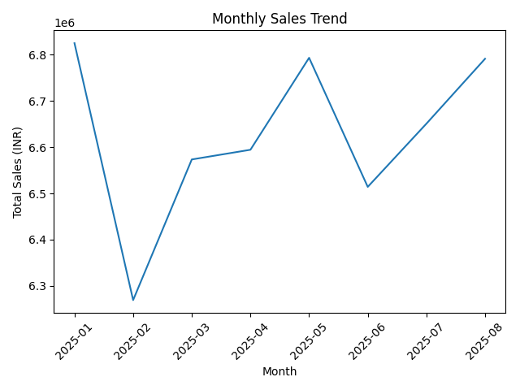
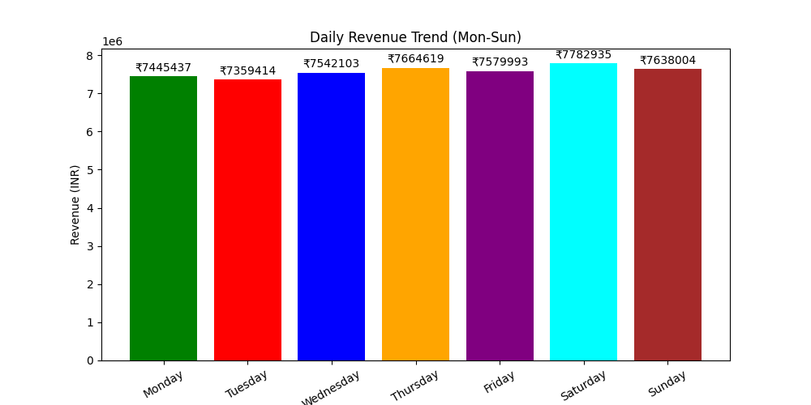
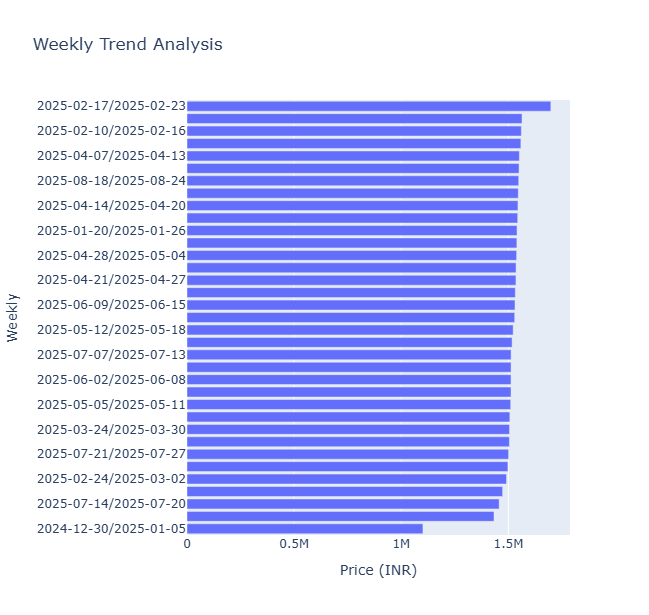
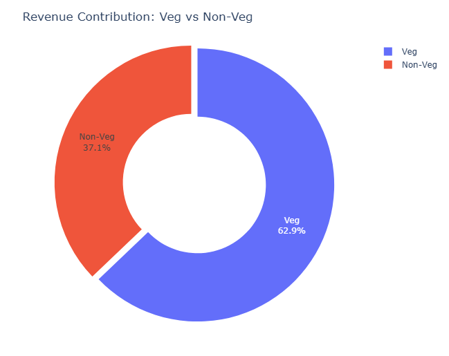
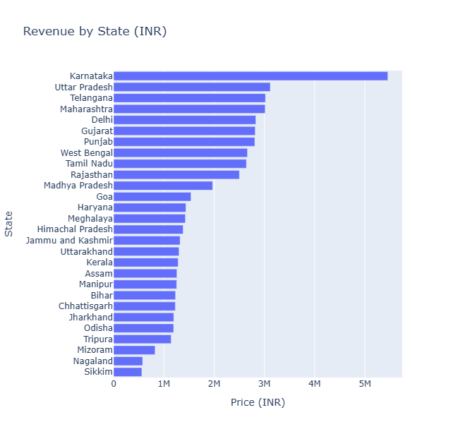
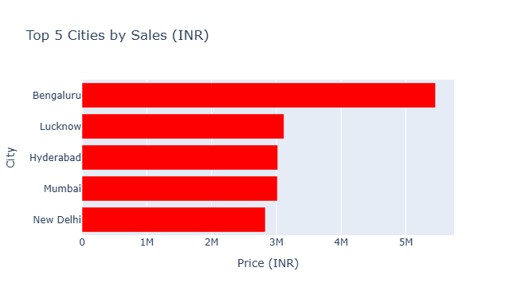

# Swiggy Sales & Performance Analysis — 2025

## Project Overview

This project analyzes Swiggy food-order data to understand sales performance, customer ratings, order trends, food categories, and geographical performance.

The analysis focuses on important business KPIs such as Total Sales, Average Rating, Average Order Value, Ratings Count, and Total Orders.

## Objectives

The main objectives of this project are:

* Analyze overall sales performance
* Calculate important business KPIs
* Identify monthly and weekly sales trends
* Compare Veg and Non-Veg sales
* Analyze state-wise sales performance
* Identify the top 5 cities by sales
* Analyze quarterly performance
* Understand customer rating patterns

## Key KPIs

* Total Sales
* Average Rating
* Average Order Value
* Ratings Count
* Total Orders

## Analysis Performed

* Monthly Sales Trend
* Daily Sales Trend
* Weekly Sales Trend
* Quarterly Performance
* Veg vs Non-Veg Sales
* State-wise Sales
* Top 5 Cities by Sales

## Project Visualizations

### Monthly Sales Trend



### Daily Sales Trend



### Weekly Sales Trend



### Veg vs Non-Veg Sales



### State-wise Sales



### Top 5 Cities by Sales




## Tools & Technologies

* Python
* Pandas
* NumPy
* Matplotlib
* Seaborn
* Plotly
* Jupyter Notebook
* Microsoft Excel

## Project Structure

```text
swiggy-sales-analysis/
│
├── README.md
├── Swiggy_Sales_Analysis_2025.ipynb
├── requirements.txt
│
├── data/
│   └── swiggy_data.xlsx
│
└── presentation/
    └── Swiggy_Sales_Analysis_Presentation.pptx
```

## Project Workflow

```text
Raw Data
   ↓
Data Cleaning
   ↓
Data Exploration
   ↓
KPI Calculation
   ↓
Data Analysis
   ↓
Data Visualization
   ↓
Business Insights
```

## Conclusion

This project demonstrates practical data analysis skills using Python. The analysis converts food-order data into meaningful business insights related to sales, orders, ratings, food categories, and geographical performance.
